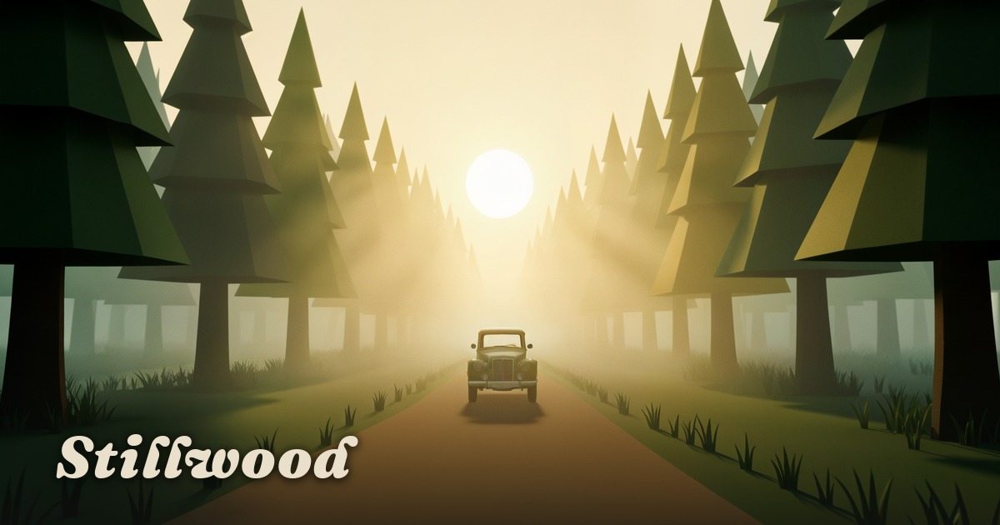
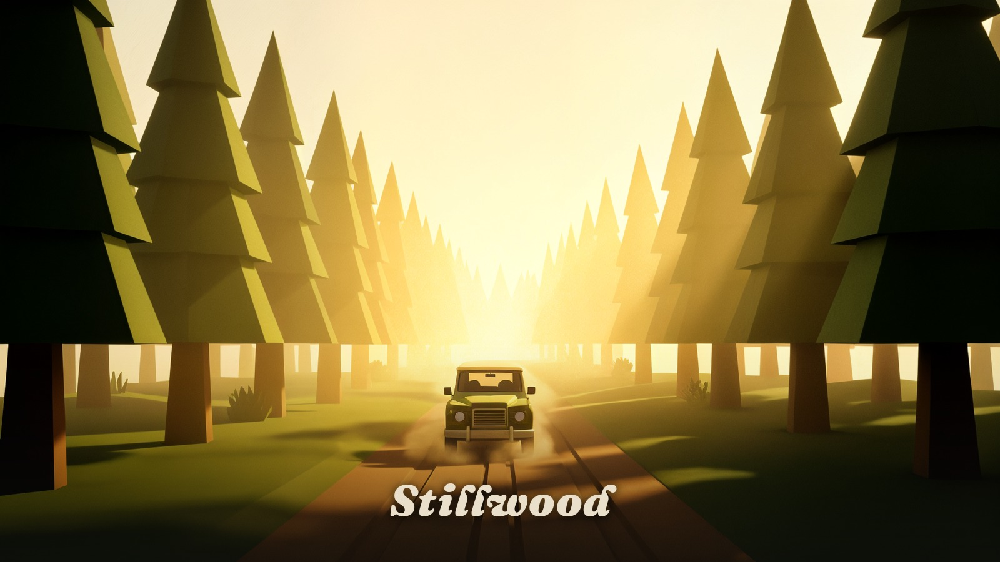

<div align="center">

# Stillwood

### _A quiet drive through an endless forest._

An endless forest. No map. No hurry. Follow the dirt path, or leave it.

[Play now](https://kutral.github.io/stillwood/) · [Report a bug](#issues) · [Built with](#built-with)

</div>

---

## About

**Stillwood** is a meditative driving sim built in the browser. The world rolls
on forever — pine trees, meadows, distant mountains — and a small olive-green
jeep that hums along the dirt path. There is no score, no timer, no objective.
You just drive.

The whole thing is one screen, one `<canvas>`, and one quiet render loop. The
three.js scene blends low-poly trees with simplex-noise terrain, soft shadows,
an exponential fog, and a Bloom + Vignette + SMAA post pass. Touch controls on
mobile, full keyboard on desktop.

> "The forest keeps. Resume whenever you like."

---

## Preview

<div align="center">

| Desktop | Mobile |
| :---: | :---: |
|  |  |

</div>

---

## Features

- **Endless procedural world** — the forest streams around you; you never
  reach an edge.
- **Soft 3D scene** — low-poly trees, rolling terrain, drifting dust,
  dynamic sun position.
- **Two cameras** — chase cam for the cinematic view, hood cam to feel the
  road. Tap **C** in-game (desktop) or the **camera** button in the pause
  menu to swap.
- **Physics-driven driving** — modeled grip, handbrake slide, body roll
  from terrain, collision with trees.
- **Adaptive quality** — high (shadows + Bloom) or soft (no shadows, no
  post), switchable from the pause menu.
- **Audio** — gentle ambience (sliders for ambience and engine, mute toggle).
- **Mobile-first controls** — analog stick + brake pedal, no on-screen
  keyboard.
- **Reduced-motion friendly** — respects the OS preference.
- **PWA-ready** — installable on iOS and Android.

---

## Play

**[kutral.github.io/stillwood](https://kutral.github.io/stillwood/)** — plays
in any modern browser, no install needed.

### Controls

| Action | Desktop | Mobile |
| :--- | :---: | :---: |
| Drive forward | `W` / `↑` | Push stick up |
| Reverse | `S` / `↓` | Push stick down |
| Steer | `A` `D` / `←` `→` | Push stick left / right |
| Slide | `Space` | Tap & hold **BRAKE** |
| Switch camera | `C` | Pause menu → camera |
| Pause | `Esc` | Pause button (top-right) |

---

## Built with

- **[Vite 8](https://vitejs.dev/)** — build + dev server
- **[React 19](https://react.dev/)** + **[TanStack Start](https://tanstack.com/start)**
- **[Three.js](https://threejs.org/)** + **[@react-three/fiber](https://r3f.docs.pmnd.rs/)** + **drei** — 3D scene
- **[@react-three/postprocessing](https://github.com/pmndrs/react-postprocessing)** — Bloom, Vignette, SMAA
- **[Tailwind CSS v4](https://tailwindcss.com/)** — overlay UI
- **[Zustand](https://zustand.demobo.com/)** — game state
- **[simplex-noise](https://github.com/jwagner/simplex-noise.js)** — terrain generation
- **[Lucide](https://lucide.dev/)** — icons
- **[Fraunces](https://fonts.google.com/specimen/Fraunces) + [Outfit](https://fonts.google.com/specimen/Outfit)** — typography

---

## Develop

```bash
npm install
npm run dev        # dev server on http://localhost:8080
npm run build      # production build (Vercel-style)
npm run build:pages  # GitHub Pages static build → pages-dist/
```

The project has two build modes:

| Command | Output | Use |
| :--- | :--- | :--- |
| `npm run build` | `.output/` (Nitro) | Vercel / Node |
| `npm run build:pages` | `pages-dist/` | GitHub Pages |

Both compile the same `src/game/` tree, but the Pages build swaps the
TanStack Start server for a single static `index.html` that mounts the
`<Stillwood />` component directly.

### Project layout

```
src/
├─ game/                  # the game itself (no auth, no server)
│  ├─ Stillwood.tsx       # entry component
│  ├─ ForestScene.tsx     # <Canvas> + game loop
│  ├─ vehicle.ts          # physics + integration
│  ├─ world.ts            # terrain + collision
│  ├─ input.ts            # keyboard, touch, gamepad sampling
│  ├─ audio.ts            # ambience + engine
│  ├─ store.ts            # zustand state
│  └─ ui/Overlays.tsx     # start screen, HUD, pause, touch controls
├─ lib/                   # platform helpers (auth, data, multiplayer)
├─ routes/                # TanStack Start routes
└─ styles.css             # Tailwind v4 entry
```

---

## Performance notes

- Forest chunks are GPU-instanced — thousands of trees, one draw call.
- Shadows, Bloom, and SMAA are gated behind the **high** quality preset.
  On mid-range mobile, **soft** keeps frame times under 16 ms.
- The render loop is fixed at 60 Hz simulation, with up to 4 substeps per
  frame to absorb tab-throttling spikes.

---

## Deploy

GitHub Pages: push to `main` and `.github/workflows/pages.yml` builds +
publishes `pages-dist/`.

Vercel: `npm run build` is enough — the workspace ships a Nitro preset.

---

## License

Personal project. The forest, the jeep, the hum of the engine — all
handcrafted. Take a drive.

---

<div align="center">

<sub>Built in a quiet corner of the woods.</sub>

</div>
